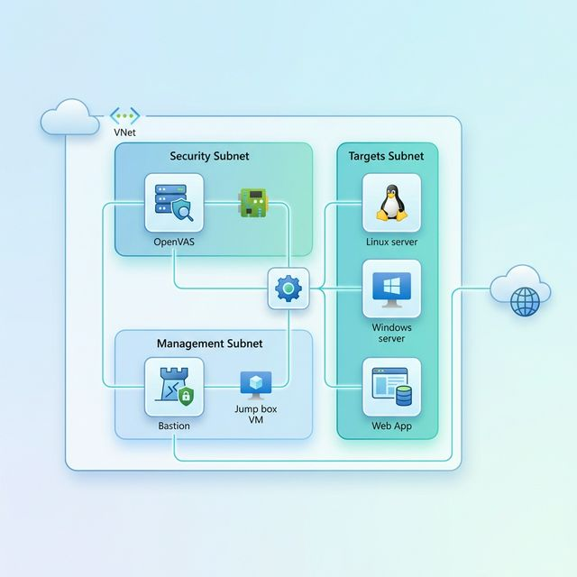

# Vulnerability Management Lab

A comprehensive, automated vulnerability management lab environment deployed on Azure using Terraform. This project provides a sandbox for security professionals to practice scanning, detection, and remediation of vulnerabilities across various operating systems and web applications.



## Overview

This lab environment consists of several key components designed to simulate a realistic corporate network with integrated security controls.

### 🛡️ Vulnerability Scanner (OpenVAS)
The lab features a pre-configured **OpenVAS** (Greenbone Vulnerability Management) instance.
- **Deployment**: Automated via `cloud-init` on Ubuntu 22.04.
- **Architecture**: Runs as a multi-container Docker application (`gvmd`, `gsa`, `ospd-openvas`).
- **Functionality**: Performs authenticated and unauthenticated scans across the internal network.

### 🎯 Target Systems
The lab includes diverse targets to test different attack vectors:
- **Linux Server**: A standard Ubuntu instance used for auditing OS vulnerabilities and testing Syslog-based detection.
- **Windows Server**: A Windows Server 2022 instance with:
    - **Audit Policies**: Pre-configured for deep visibility into process execution and login events.
    - **Attack Simulation**: Includes a custom PowerShell script that simulates "bad behavior" (e.g., suspicious process execution, failed logon spikes) to trigger SIEM alerts.
- **Web Applications**: Dockerized versions of **OWASP Juice Shop** and **DVWA** (Damn Vulnerable Web Application) for web-specific vulnerability assessment.

### 🔍 Monitoring & SIEM (Sentinel)
A robust monitoring stack is deployed to provide real-time visibility and incident response capabilities:
- **Microsoft Sentinel**: The primary SIEM, pre-configured with **Scheduled Analytics Rules**:
    - `SOC Lab - SSH brute force attempts`: Detects repeated failed SSH logins.
    - `SOC Lab - New local user created`: Identifies unauthorized user additions.
    - `SOC Lab - NSG deny spike`: Monitors firewall logs for potential port scanning or lateral movement.
- **Defender for Cloud**: Configured with the **Standard (StandardSSD_LRS)** pricing tier for Virtual Machines to provide enhanced threat protection and vulnerability assessment.
- **Azure Monitor Agent (AMA)**: Installed on all VMs to stream security events and Syslog data to a central **Log Analytics Workspace**.

## Architecture

The lab is isolated within an Azure Resource Group and follows best practices for secure network segmentation:
- **Management Subnet**: Houses the **Azure Bastion** service for secure, browser-based RDP/SSH access without public IP exposure.
- **Security Subnet**: Isolated subnet for the OpenVAS scanner with controlled access to the target environment.
- **Targets Subnet**: Contains vulnerable systems, isolated from the management plane but reachable by the scanner and monitoring agents.

## Prerequisites

- [Terraform](https://www.terraform.io/downloads.html) v1.0+
- [Azure CLI](https://docs.microsoft.com/en-us/cli/azure/install-azure-cli)
- An active Azure Subscription

## Getting Started

1. **Clone the repository**:
   ```bash
   git clone https://github.com/KareemMoataz02/vuln-mgmt.git
   cd vuln-mgmt
   ```

2. **Login to Azure**:
   ```bash
   az login
   ```

3. **Initialize Terraform**:
   ```bash
   terraform init
   ```

4. **Plan the deployment**:
   ```bash
   terraform plan
   ```

5. **Apply the configuration**:
   ```bash
   terraform apply
   ```

## Included Modules

- **Network**: Defines the VNet, Subnets, and Network Security Groups (NSGs).
- **Bastion**: Deploys Azure Bastion for secure management.
## Testing the Lab

Follow these steps to verify your lab environment is fully functional:

### 1. Verify Deployment
Once `terraform apply` completes, verify the outputs:
```bash
terraform output
```
Note the private IPs for the `openvas`, `linux_target`, and `windows_target`.

### 2. Access the Environment
Secure access is provided via **Azure Bastion**.
- **Web Access**: Navigate to the Azure Portal, select a VM (e.g., `openvas`), and click **Connect > Bastion**.
- **CLI Access**:
  ```bash
  az network bastion ssh --name <bastion_name> --resource-group <rg_name> --target-resource-id <vm_id> --auth-type ssh-key --username azureuser --ssh-key ~/.ssh/id_rsa
  ```

### 3. Vulnerability Scanning (OpenVAS)
1. Connect to the **OpenVAS VM** via Bastion.
2. The scanner web UI is available at `https://<openvas_private_ip>:9392`.
   - *Note: Since this is an internal IP, you may need a SOCKS proxy via SSH or access from another VM in the VNet.*
3. **Login**: Default credentials are `admin` / `admin`.
4. **Run a Scan**:
   - Go to **Scans > Tasks**.
   - Use the **Task Wizard** (magic wand icon).
   - Enter the Targets subnet range (e.g., `10.0.2.0/24`) and click **Start Scan**.

### 4. Trigger SIEM Alerts (Microsoft Sentinel)
Test the detection rules by simulating attacks:
- **SSH Brute Force**: From the OpenVAS VM (or any other VM in the VNet), attempt to SSH into the Linux Target multiple times with a wrong password:
  ```bash
  for i in {1..10}; do ssh adminuser@<linux_target_ip>; done
  ```
- **Windows Attack Simulation**: The Windows VM automatically runs a simulation script on startup. You can manually trigger it via the Custom Script Extension or by manually failing several RDP logins.
- **Verification**:
  1. In the Azure Portal, go to **Microsoft Sentinel**.
  2. Select your workspace and click on **Incidents**.
  3. You should see alerts like `SOC Lab - SSH brute force attempts` or `SOC Lab - NSG deny spike` within 5-15 minutes.

## License

This project is licensed under the MIT License - see the [LICENSE](LICENSE) file for details.
